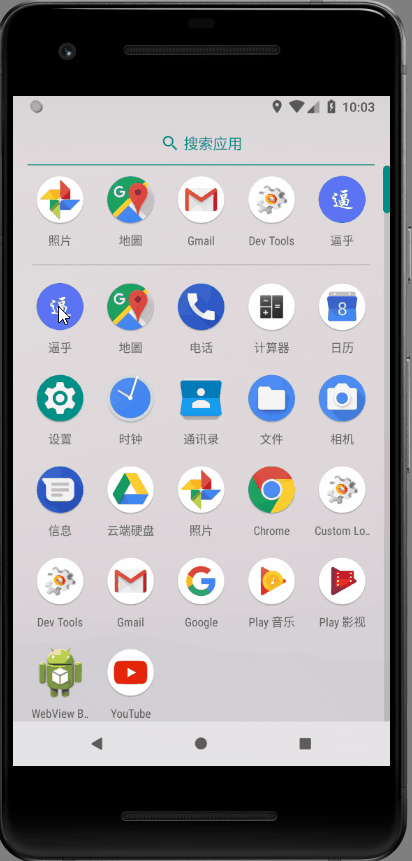
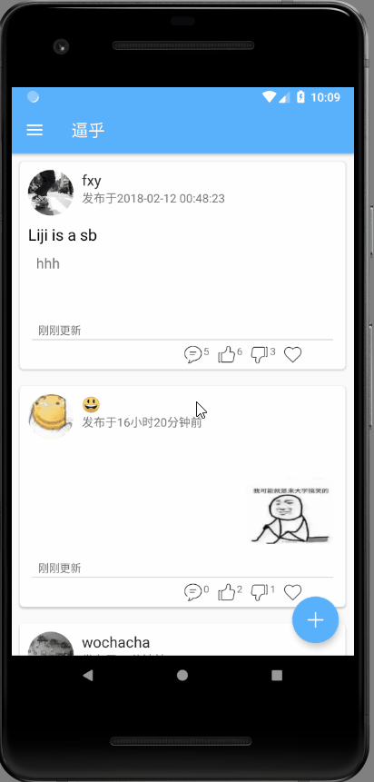
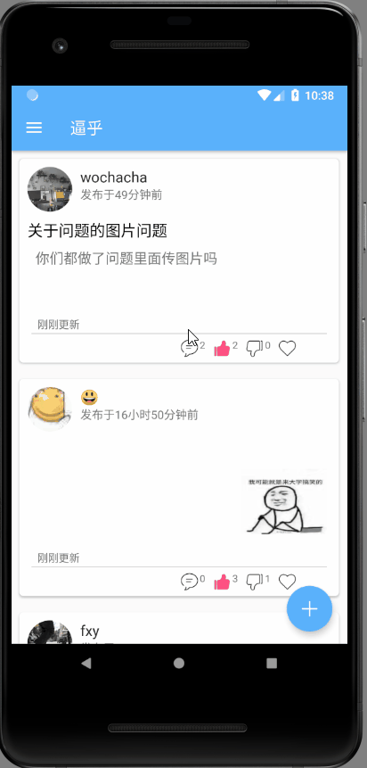
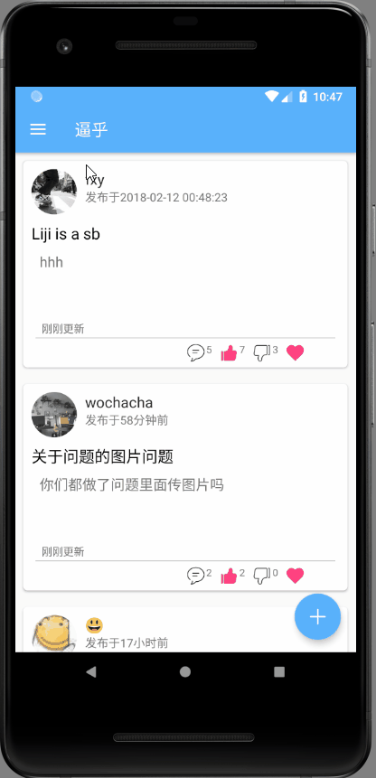
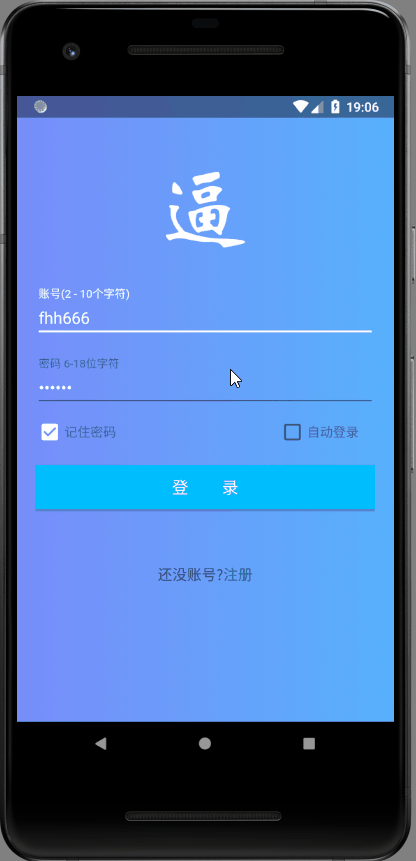

# 重邮红岩移动Android学员寒假考核作业-逼乎

 
## APP下载
[点我下载](http://www.fenghaha.xyz:8080/bihu.apk)
 
## 应用简介
* 实现了*Jay68*提供的[逼乎api](https://github.com/jay68/bihu_web/wiki/%E9%80%BC%E4%B9%8EAPI%E6%96%87%E6%A1%A3) 所有接口   
* 图片存储使用七牛云
* 七牛云的token获取使用 [子来学姐提供的接口](https://github.com/Zzzia/qiniuToken)  
* 全部使用原生api完成,未使用第三方库
 

## 功能展示
+ 注册、登录、登出 

+ 加载、刷新问题列表 

+ 赞、踩、收藏 

+ 收藏列表 

+ 提问 

+ 回答问题 

+ 修改头像 

+ 修改密码 

+ 自动登录 

## 开发者

FengHaHa
